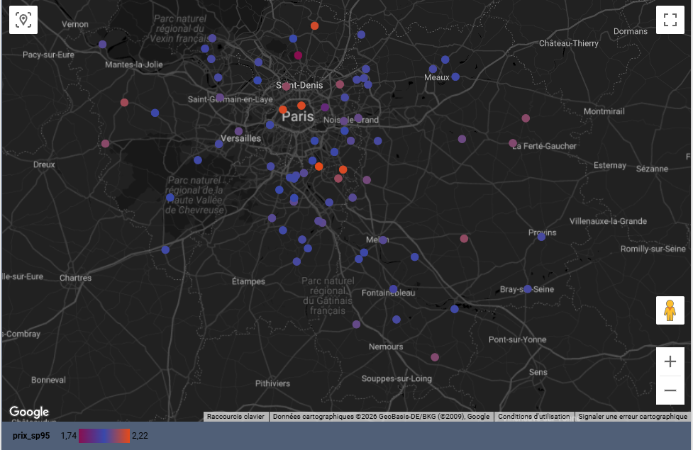
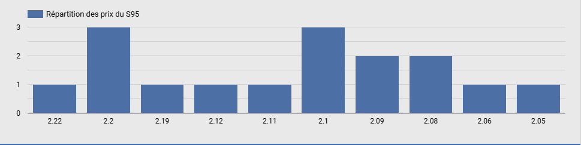
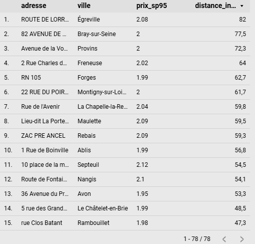

# ⛽ Analyse du Prix du SP95 en Île-de-France

## 🎯 Objectif
Analyser les prix du SP95 dans 78 stations essence d'Île-de-France
à partir des données gouvernementales ouvertes, avec cartographie
interactive et identification de la station la moins chère dans un
rayon défini autour d'une adresse cible.

## 📁 Dataset
- **Source** : data.gouv.fr — données ouvertes carburants
- **Volume** : 78 stations essence en Île-de-France
- **Départements** : 75, 77, 78, 91, 92, 93, 94, 95

## 🔍 Démarche
1. **Ingestion** — chargement des données dans BigQuery
2. **Requête SQL géospatiale** — calcul des distances avec
   `ST_DISTANCE` et `ST_GEOPOINT`
3. **Visualisation** — dashboard interactif sur Looker Studio

## 💡 Fonctionnalités du dashboard
- 🗺️ Carte interactive avec code couleur prix (bleu = moins cher
  → orange = plus cher)
- 📊 Répartition des prix du SP95 en IDF
- 📋 Classement des 78 stations par distance depuis une adresse cible
- 🔍 Filtre par rayon kilométrique autour d'un point de référence

## 🧠 Requête SQL clé
```sql
SELECT
  adresse,
  ville,
  CONCAT(adresse, " ", code_postal, " ", ville) AS adresse_complete,
  ROUND(prix_sp95, 2) AS prix_sp95,
  ROUND(
    ST_DISTANCE(
      ST_GEOGPOINT(2.421198, 48.851481),
      ST_GEOGPOINT(longitude, latitude)
    ) / 1000, 1
  ) AS distance_in_kms
FROM `fr_carburants.fr_carburant`
WHERE code_departement IN ("75","77","78","91","92","93","94","95")
  AND prix_sp95 IS NOT NULL
ORDER BY distance_in_kms ASC
```

## 📸 Aperçu du dashboard

### Carte interactive — prix par station


### Répartition des prix du SP95


### Classement des stations par distance


## 🛠️ Stack technique
- **BigQuery** — stockage et requêtes SQL géospatiales
- **SQL** — `ST_DISTANCE`, `ST_GEOPOINT`, `CONCAT`, `ROUND`
- **Looker Studio** — dashboard interactif

## 👤 Auteur
**Haroun Elias**
[LinkedIn](https://linkedin.com/in/elias-haroun) ·
[GitHub](https://github.com/Eliashrn)
